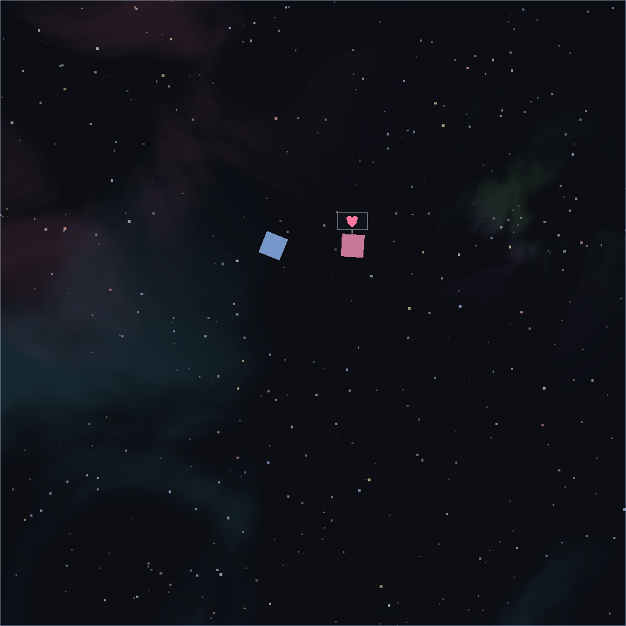

# LunchTea

**[lunchtea-app.vercel.app](https://lunchtea-app.vercel.app/)**

작업 중 기다려야 할 때, 잠깐 차 한잔 하고 가세요.

While you wait on something at work, stop by for a cup of tea.

A small Windows desktop toy. Bring the mouse cursor into the window and
something happens; move it out and it goes back to just running on its own.
More toys will keep being added to the same program.

## Download

Grab the latest build from the [**Releases**](../../releases) page.

| Build | For |
|-------|-----|
| `LunchTea-<ver>-win-x64.zip` | Unzip and run — no installer |

Windows 10 / 11, 64-bit.

## First run

Windows may show a SmartScreen prompt the first time — choose **More info → Run**.
Everything is stored **only on your PC** (`%APPDATA%\LunchTea\`).

## Controls

| | |
|---|---|
| Cursor into the window | It starts |
| Move the mouse | You move the cursor, that is all |
| Click | If something is clickable, it answers |
| Cursor out of the window | It switches to watching mode |

| Key | |
|---|---|
| `F1` | Overlay mode |
| `F2` | Window size |
| `P` | Window position |
| `M` / `F11` | Sound on/off |
| `F12` | Volume |
| `Shift + Esc` | Quit |

Right-click the title bar to change settings or see the shortcuts.

## About this repository

This is the public home of LunchTea — the website (deployed on Vercel) and the
release binaries. The application source is kept private for now.

Built with [MonoGame](https://github.com/MonoGame/MonoGame) (Ms-PL) ·
[SDL2](https://www.libsdl.org/) (zlib) ·
[OpenAL Soft](https://openal-soft.org/) (LGPL 2.1) ·
[JetBrains Mono](https://github.com/JetBrains/JetBrainsMono) (SIL OFL 1.1).
